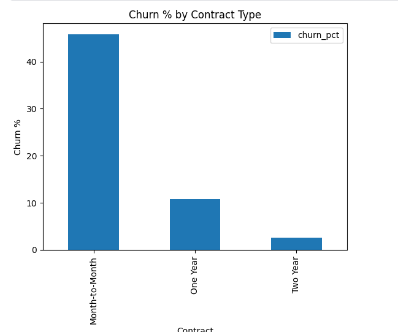

## Telecom Customer Churn Analysis (Python + SQL)

**Author:** Nikhil Lingala

**Tools Used:** Python, Pandas, Matplotlib, DuckDB SQL, Jupyter/Kaggle Notebook

---

### 1) Problem Statement

Telecom companies lose a lot of customers every month. This project finds:

* who is churning
* why they are churning
* which segments are at highest risk
* where company should take corrective action

Goal → convert raw data → insights → recommendations.

---

### 2) Dataset

Dataset: IBM Telco Customer Churn Dataset
(Original Source: IBM Sample Data / Public Kaggle)

**Rows:** ~7000 customers
**Columns:** 50 features including demographics, charges, contract, churn reason, etc.

I used my local downloaded csv file: `telco.csv`

---

### 3) Steps Performed

#### 🔹 Step 1 → Import Libraries

```python
import pandas as pd
import numpy as np
import matplotlib.pyplot as plt
```

#### 🔹 Step 2 → Read Data

```python
df = pd.read_csv('/kaggle/input/telco.csv')
df.head()
```

#### 🔹 Step 3 → Clean Columns

```python
df.columns = df.columns.str.strip()
df = df.rename(columns={'Churn Label':'Churn'})
df['Churn_Flag'] = (df['Churn']=='Yes').astype(int)
```

---

### 4) SQL Analysis using DuckDB

#### Install + Setup

```python
import duckdb
con = duckdb.connect()
con.register('telco', df)
sql = con.execute
```

#### Churn Count

```sql
SELECT Churn, COUNT(*) AS cnt
FROM telco
GROUP BY Churn;
```

#### Churn % by Contract Type

```sql
SELECT Contract,
       ROUND(AVG(CAST(Churn_Flag AS FLOAT))*100,2) AS churn_pct
FROM telco
GROUP BY Contract
ORDER BY churn_pct DESC;
```

#### Churn Reason Category

```sql
SELECT [Churn Category], COUNT(*) AS customers,
       ROUND(AVG(CAST(Churn_Flag AS FLOAT))*100,2) AS churn_pct
FROM telco
GROUP BY [Churn Category]
ORDER BY churn_pct DESC;
```

---

### 5) Visualizations (Matplotlib)

#### Churn % by Contract Type

```python
plt.figure(figsize=(6,5))
plt.bar(contract_df['Contract'], contract_df['churn_pct'])
plt.ylabel("Churn %")
plt.title("Churn % by Contract Type")
plt.show()
```Churn % by Contract Type


Insight:
Month-to-Month contract customers churn the most (45.8%).
This clearly shows short term contract = churn risk.

#### Churn Count by Reason

```python
plt.figure(figsize=(6,5))
plt.bar(reason_df['Churn Category'], reason_df['customers'])
plt.xticks(rotation=45)
plt.title("Churn Count by Reason Category")
plt.show()
```Churn Customers by Reason Category


Insight:
Most churners are leaving due to Competitor.
Second reason is Attitude / Dissatisfaction.

---

### 6) Key Insights

| Insight                                        | Meaning                                           |
| ---------------------------------------------- | ------------------------------------------------- |
| Month-to-Month customers churn the most (~45%) | Short term customers are risky                    |
| Competitor is the top churn reason             | Customers leaving due to better competitor offers |
| 1+ year contracts churn very low               | lock-in helps reduce churn                        |

---

### 7) Recommendations

| Action                                               | Why                                     |
| ---------------------------------------------------- | --------------------------------------- |
| Create retention offers for Month-to-Month customers | biggest churn segment                   |
| Provide competitive device & plans                   | competitor better devices is top reason |
| Introduce loyalty benefits after 6 months            | convert M2M → annual contracts          |

---

### 8) What this project proves

* I can clean messy business datasets
* I can combine Python + SQL to answer business questions
* I can convert insights → business recommendations

---

### 9) Next Enhancements (future work)

* Build Power BI dashboard interface
* Predict churn using a ML model (RandomForest)
* Deploy dashboard + notebook as web report

---


